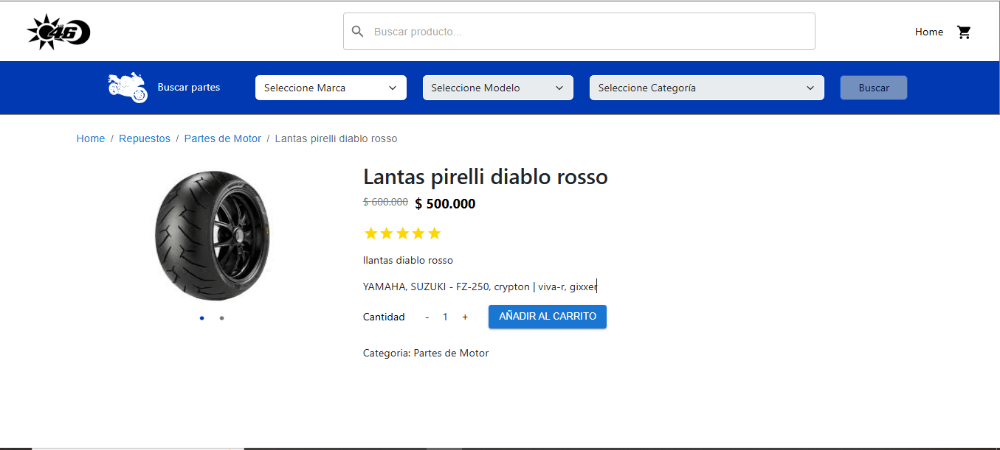

# 🛍️ E-Commerce con React.js y ePayco

Esta aplicación de comercio electrónico, desarrollada en **React.js**, ofrece una experiencia de compra en línea intuitiva y eficiente.

## 🚀 Características

- **Pagos con ePayco:** Soporte para pagos con Nequi, PSE y Efecty.
- **Interfaz moderna:** Construida con React.js y estilizada con CSS/Sass.
- **Backend con Node.js y PostgreSQL:** Manejo eficiente de productos, categorías y pagos.

---

## 🛠️ Tecnologías Utilizadas  

### **Frontend**  
- **React.js**: Construcción de una interfaz de usuario moderna y dinámica.  
- **CSS/Sass**: Estilización personalizada para mejorar la experiencia del usuario.  

### **Backend**  
- **Node.js**: Servidor backend eficiente y escalable.  
- **Express.js**: Framework para la gestión de rutas y controladores.  

### **Base de Datos**  
- **PostgreSQL**: Base de datos relacional que garantiza la integridad y seguridad de los datos.  
- **Prisma ORM**: Facilita la gestión de la base de datos y simplifica la interacción con los datos.  

### **Funcionalidades del Backend**  
- **CRUD de Productos y Categorías**: Controladores diseñados para la creación, lectura, actualización y eliminación de productos y categorías.  
- **Autenticación y Autorización**: Gestión segura de usuarios y accesos.  

---

## 📌 Requisitos y Configuración

### **1️⃣ Backend (Obligatorio)**

Este proyecto funciona junto con un **backend** en Node.js, alojado en el siguiente repositorio:
🔗 [co-yamaha-back](https://github.com/johan9846/co-yamaha-back.git)

Para configurarlo, sigue estos pasos:

1. **Clonar el repositorio**

   ```bash
   git clone https://github.com/johan9846/co-yamaha-back.git
   cd co-yamaha-back
   ```

2. **Instalar dependencias**

   ```bash
   npm install
   ```

3. **Levantar la base de datos en Docker**

   ```bash
   docker compose up -d
   ```

4. **Ejecutar la semilla de datos**

   ```bash
   node src/seed/loadDataDb.js
   ```

5. **Levantar el backend**

   ```bash
   npm run dev
   ```

---

### **2️⃣ Frontend**

Para ejecutar el frontend en tu entorno local:

1. **Clonar el repositorio**

   ```bash
   git clone https://github.com/johan9846/co-store-yamaha-front.git
   ```

2. **Crear el archivo de variables de entorno**
   crear carpeta "env" y dentro crear archivo ".env" y dentro pegar lo que esta en .env.template

3. **Instalar dependencias**

   ```bash
   npm install
   ```

4. **Ejecutar el proyecto**

   ```bash
   npm run dev
   ```

---


